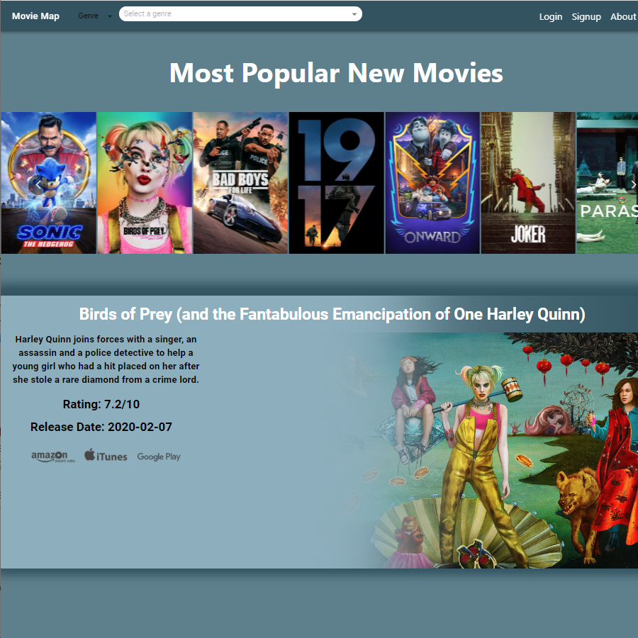

## Movie Map 2

## Description

Our application helps film buffs receive personalized recommendations and information on how to watch their finds, without having to search through multiple apps, websites, and subscription services. Using various film APIs we were able to create an app that allows for registered users to receive tailored film recommendations, with information for how to watch the recommended films. In addition, registered users can save their searches and create watchlists. Movie Map saves time by being a one stop film search engine.

## Motivation

We had the idea for Movie Map when a teammate found themselves having to flip through each of their media subscriptions for a film to watch and then having to flip back and forth to narrow down the search and find a film that was interesting. They figured having a web app where they could receive tailored film recommendations and the immediate information on where to watch them would save time they could spend, well, watching movies.

## Results

Using various film APIs we were able to create an app that allows registered users to receive tailored film recommendations with information and links for how to watch each film. In addition, registered users can save their searches, create watchlists, and make modifications to their user account. Non-registered users can still use the app as a film search engine. Movie Map saves time by being a one stop film search engine.

## Prerequisites

**Web browser.** - _We recommend Google Chrome._

## Installing

N/A - Not applicable - No installation required.

## Getting Started

1. Open web browser.
2. Navigate to movie-map.herokuapp.com (https://movie-map.herokuapp.com/)

## Flow, creating your user profile

1. Create your own user account by selecting the ‘Sign Up’ link on the top right corner of the page.
2. Enter your email, username, and password on the page and you will be redirected to the landing page with the option now to create a watchlist, save your favorite films,and get increasingly personalized recommendations as you search and view more films.

## Flow, registered users

1. On the top right corner of the landing page select ‘Login’.
2. Enter your credentials to access your personalized page. Several rows of carousels will generate: Popular Movies, Last Search, Because You watched, Trending Films
3. For a search, select genre in the search bar.
4. The app will then generate a carousel of film recommendations below the default carousel of current top films.
5. Click a film in the carousel to see additional film details and list of service providers. Each service provider name will serve as a link to connect to the film page on the providers site. In the detail box you can save films for later viewing.

## Did you forget your password? No problem

## Technologies in this project

- [CSS](https://www.w3.org/Style/CSS/Overview.en.html/) - Cascading Style Sheets is a style sheet language used for describing the presentation of a document written in a markup language like HTML. CSS is a cornerstone technology of the World Wide Web, alongside HTML and JavaScript.
- [HTML5](https://www.w3.org/html/) - HTML5 is a markup language used for structuring and presenting content on the World Wide Web. HTML5 was the fifth and last major version of HTML that is a World Wide Web Consortium recommendation.
- [JavaScript](https://www.javascript.com/) - JavaScript, often abbreviated as JS, is a programming language that conforms to the ECMAScript specification.
- [Material UI](https://material-ui.com/) - A modern responsive front-end framework.
- [MongoDB](https://www.mongodb.com/) - MongoDB is a general purpose, document-based, distributed database built for modern application developers and for the cloud era. No database makes you more productive.
- [Mongojs](https://www.npmjs.com/package/mongojs/) - A node.js module for mongodb, that emulates the official mongodb API as much as possible.
- [Node.js](https://nodejs.org/en/) - As an asynchronous event-driven JavaScript runtime, Node.js is designed to build scalable network applications.
- [React](https://reactjs.org/) - A JavaScript library for building user interfaces.
- [JWT & Cookie](https://jwt.io/) - An open, industry standard RFC 7519 method for representing claims securely between two parties.
- [Nodemailer & SendGrid](https://nodemailer.com/about/) - Nodemailer: A module for Node.js applications to allow email sending & SendGrid: a cloud-based SMTP provider
- [TMDb](https://www.themoviedb.org/documentation/api/) - API: The Movie Database (TMDb) is a community built movie and TV database.
- [Utelly](https://www.utelly.com/) - API: Metadata aggregation, search, recommendations and content promotion channels. Delivered as a Cross-platform SaaS Product.

## Features in future releases

- Moving forward, it would be beneficial to have our own inhouse review database.
- We would also like to add a TV recommendation functionality.

## Authors

- **Emily Yu** - _Backend_ - [bluerainmango](https://emily-yu-portfolio.herokuapp.com/) - Authentication, user communications and APIs.
- **Fabiola Guzman** - _Frontend_ - [fguzmanrs](https://github.com/fguzmanrs) - Project lead and app style.
- **Francisco Ortiz** - _Backend_ - [ffortizn](https://github.com/ffortizn) - Lead database coder.
- **Hayden Cross** - _Frontend_ - [HCross28](https://github.com/HCross28) - Lead UI designer & app layout.

## Some technical documentation

[Don't click, it is kind of technical](https://drive.google.com/drive/u/0/folders/1zCejLJMu0FXk1kbjKm0YaBqTdvrpExLg)
